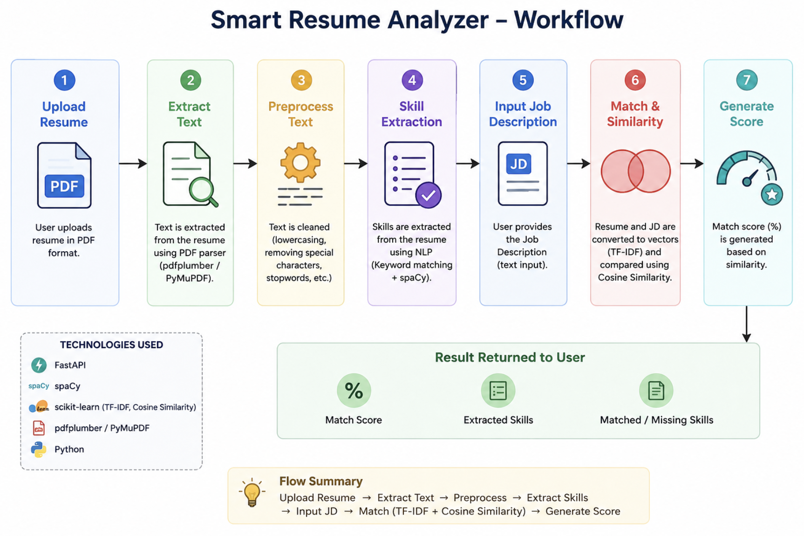
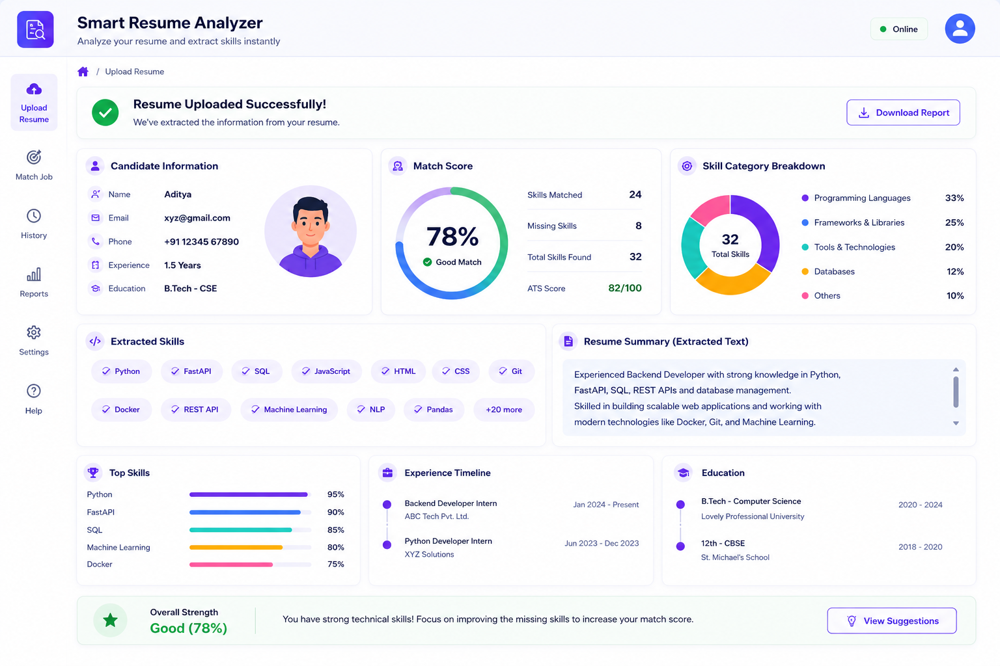
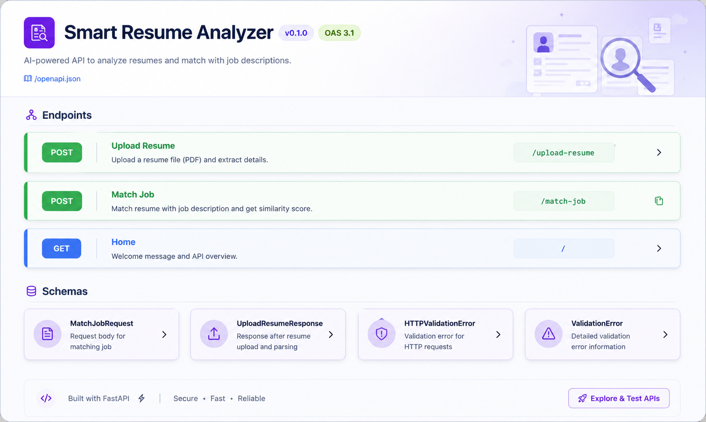
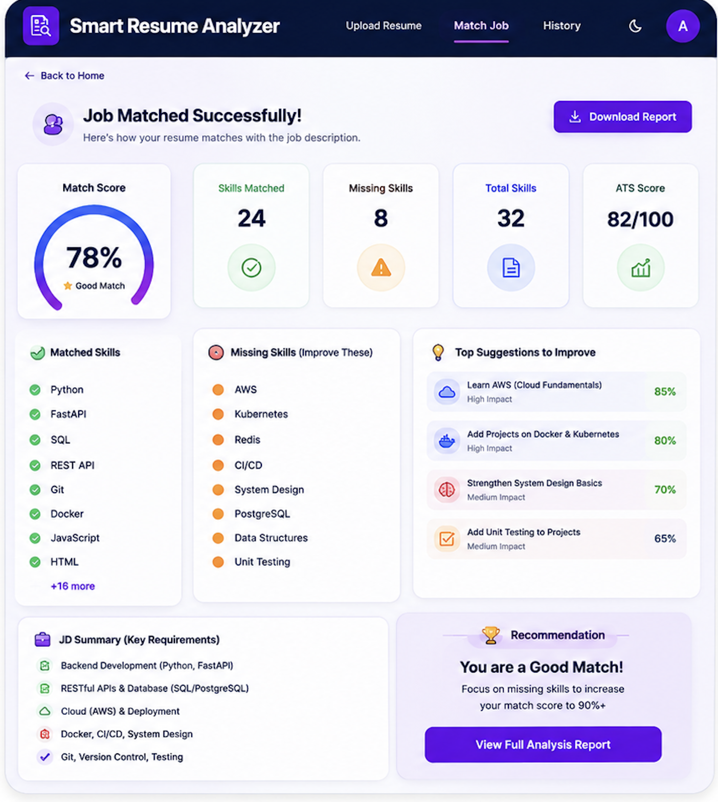

# 📄 Smart Resume Analyzer

An AI-powered Smart Resume Analyzer built to automate resume screening and candidate evaluation. The system allows users to upload resumes, intelligently extracts important information, identifies technical skills, analyzes candidate profiles, and recommends suitable job opportunities based on matching skills.

Traditional resume screening is time-consuming and requires manual effort. This project simplifies that process by using text extraction and intelligent analysis to generate meaningful insights from resumes quickly and efficiently.

---

## 🚀 Key Features

Resume upload and processing  

Automatic extraction of candidate information  

Skill detection from resume content  

Resume analysis and scoring  

Job profile recommendation system  

API-based backend integration  

Interactive dashboard for results visualization  

Fast and scalable architecture  

---

## 💡 How the Project Works

The Smart Resume Analyzer follows an intelligent workflow where uploaded resumes go through multiple stages of processing and analysis.

### Step 1: Resume Upload
Users upload resumes in supported formats through the application interface.

### Step 2: Resume Parsing
The system extracts text from the uploaded resume and identifies important information such as:

- Name
- Email
- Skills
- Experience
- Education details

### Step 3: Skill Extraction and Analysis
The extracted text is analyzed to identify technical and professional skills.

Examples:

- Python
- Machine Learning
- SQL
- Data Structures
- Web Development

### Step 4: Resume Matching
The extracted skills are compared against predefined job requirements.

### Step 5: Result Generation
The system generates:

- Candidate profile information
- Resume score
- Matching job suggestions
- Analysis dashboard

---

## ⚙️ Workflow Architecture

The complete flow of the project:

1. Upload Resume  
2. Extract Text from Resume  
3. Analyze Skills  
4. Match Skills with Jobs  
5. Generate Scores  
6. Display Results



---

## 📊 Smart Dashboard

The dashboard provides a visual representation of candidate information and resume analysis results.

Features shown in dashboard:

- Extracted candidate information
- Resume score
- Skills identified
- Resume analysis output



---

## 🔗 API Interface

The project uses FastAPI as the backend service to process resume requests efficiently.

API responsibilities:

- Accept resume uploads
- Handle parsing requests
- Process extracted data
- Return structured outputs



---

## 💼 Job Match Recommendation System

The job matching module compares candidate skills with job requirements and recommends relevant opportunities.

Examples:

- Data Analyst
- Machine Learning Engineer
- Software Developer
- Backend Developer



---

## 🛠️ Technologies Used

### Frontend
- Streamlit

### Backend
- FastAPI

### Database
- SQLite

### Libraries
- Python
- Pandas
- Pydantic
- PyPDF2
- NLP

---

## 🔧 Installation

Clone the repository:

```bash
git clone https://github.com/your-username/Smart_Resume_Analyser.git
```

Move to project directory:

```bash
cd Smart_Resume_Analyser
```

Install dependencies:

```bash
pip install -r requirements.txt
```

Run application:

```bash
uvicorn app.main:app --reload
```

---

## 🎯 Future Enhancements

- ATS score prediction
- Machine learning based ranking system
- Real-time job recommendations
- Support for multiple file formats
- Resume improvement suggestions

---
